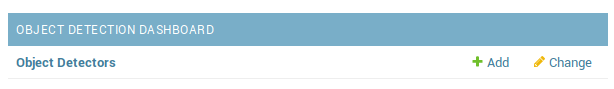
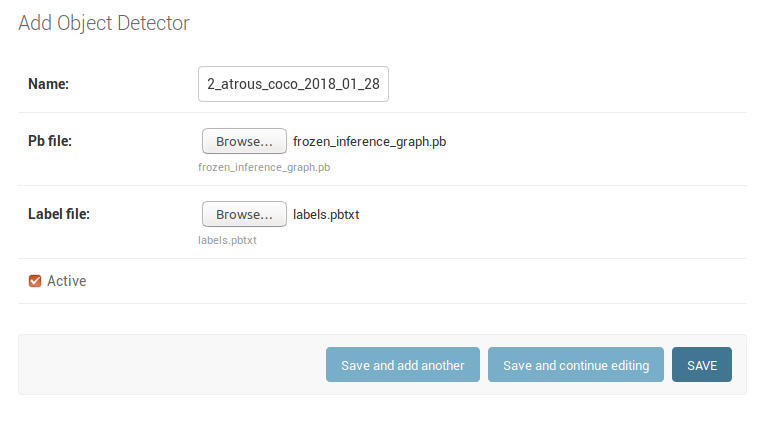
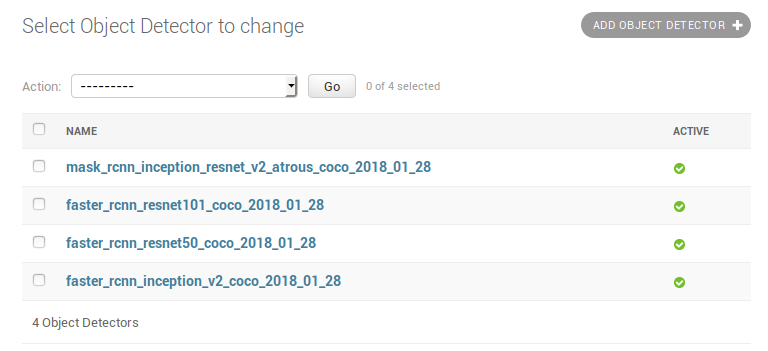
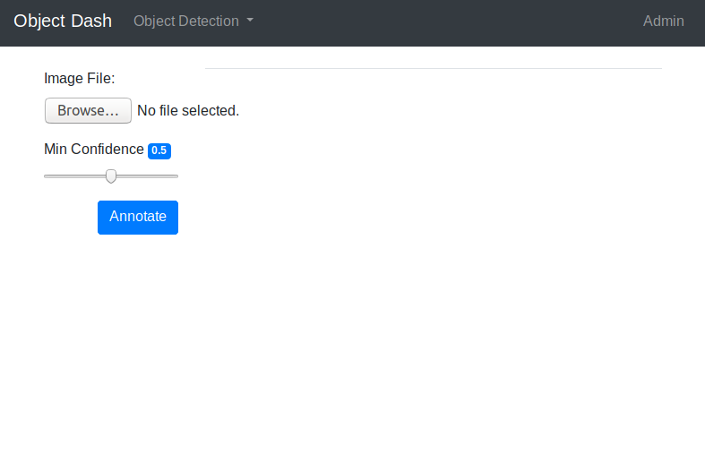
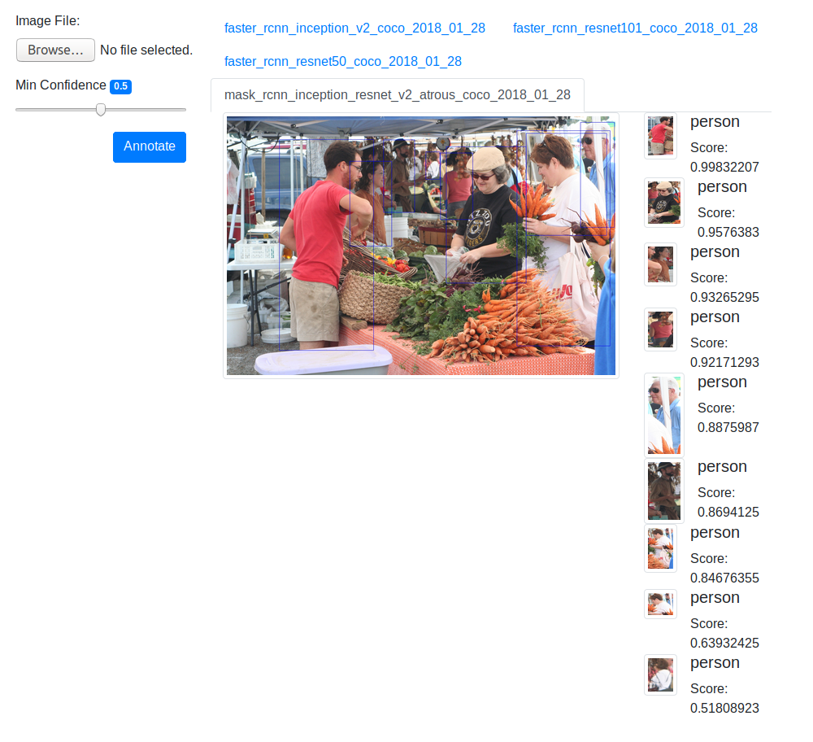

# Object detection dashboard

## Setup and Installation:

In `objectdash/settings.py` set `STATIC_ROOT` and `MEDIA_ROOT` to point to the directories where static and user 
upload content should be stored.:

```
STATIC_ROOT = '/home/baddad/workspace/objectdash/objectdash/web/static'
MEDIA_ROOT = '/home/baddad/workspace/objectdash/objectdash/web/static/media'
```

Install project requirements:

```
pipenv install .
```

Clone the tensorflow-models repository and add `models/research` to your python path to make the object_detection API 
available.

```
git clone https://github.com/tensorflow/models
echo "export PYTHONPATH=`pwd`/models/research:$PYTHONPATH" >> ~/.bashrc
source ~/.bashrc
```

You'll need to compile the protobuf objects before the object_detection API can be used:

```
protoc ./object_detection/protos/*.proto --python_out = ./
```

Create the django database (a sqlite database in the project's root directory).  

If you want to use another database see [Django's documentation](https://docs.djangoproject.com/en/2.1/intro/tutorial02/#database-setup). 

```
pipenv run ./manage.py migrate
```

Create an admin super user:

```
pipenv run ./manage.py createsuperuser
```

Run the development server:

```
$ pipenv run ./manage.py runserver
```

## Adding an object detection model

Download an object detection model from the [Tensorflow object detection model zoo](https://github.com/tensorflow/models/blob/master/research/object_detection/g3doc/detection_model_zoo.md) and extract its contents. 
If you have your own object detection models, you can install that instead.

With the server running, visit `http://localhost:8000/admin` and log in using your admin account.

On the main admin page, under *Object Detectors*, click the `Add` link: 



On the `Add Object Detector` page, specify the name, *.pb, and *.pbtxt file for your object detector, then click `SAVE`



You should now see your new model listed under Object Detectors on your server:



## Testing installed object detectors

Visit `http://localhost:8000/object_detection/single_image` on your local instance to visit the Single Image submission page



Click `Browse...` to select which image you want annotated, set your confidence threshold and click `Annotate`.

The first time you submit an image the models marked active in the database are loaded into tensorflow.  ]
This can cause a significant delay before results are displayed however any subsequent results should be significantly 
faster (using faster-rcnn models, the first image takes 8-15 seconds on my local machine.  
Subsequent requests take ~0.15 seconds to complete)

Once the results load you should see tabs for each active model, with the annotated image and extracted crops:

